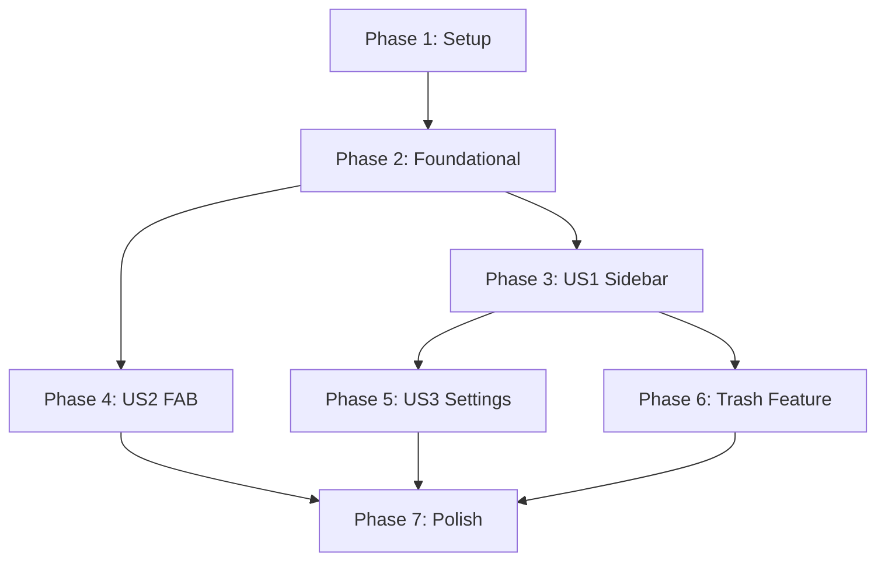

# Tasks: Mobile Sidebar Menu & UI Refactor

**Input**: Design documents from `/specs/005-mobile-sidebar-menu/`
**Prerequisites**: plan.md, spec.md, data-model.md, research.md

## Phase 1: Setup (Shared Infrastructure)

**Purpose**: Project initialization and basic structure

- [x] T001 [P] Install mobile dependencies (`@react-navigation/drawer`, `gluestack-ui`, `tamagui`) in `mobile/`
- [x] T002 [P] Configure `babel.config.js` for Reanimated and Tamagui
- [x] T003 [P] Initialize `src/theme/tamagui.config.ts` in `mobile/`

---

## Phase 2: Foundational (Blocking Prerequisites)

**Purpose**: Core infrastructure for soft delete and navigation

- [x] T004 Update `models.py` with `is_deleted` field in `Entry` model
- [x] T005 [P] Create database migration script for `is_deleted` field
- [x] T006 Update `schemas.py` to include `is_deleted` in Entry schemas
- [x] T007 Update `crud.py` to filter out deleted entries by default
- [x] T008 [P] Initialize Drawer root layout in `mobile/app/_layout.tsx`

---

## Phase 3: User Story 1 - Sidebar Navigation (Priority: P1) 🎯 MVP

**Goal**: Centralize navigation into a drawer menu

- [x] T009 [P] [US1] Create Drawer navigation items in `mobile/app/_layout.tsx` (Folders, All Notes, Kanban, Settings, Trash)
- [x] T010 [US1] Implement "Hamburger" icon in the header of `Dashboard`
- [x] T011 [US1] Remove top-right navigation buttons (Kanban, Settings, Logout) from `mobile/app/index.tsx`
- [x] T012 [US1] Ensure sidebar navigation works for all modules

---

## Phase 4: User Story 2 - Floating Action Button (Priority: P1)

**Goal**: Implement a prominent FAB for creating notes

- [x] T013 [P] [US2] Implement FAB component with Lucide "+" icon in `mobile/app/index.tsx`
- [x] T014 [US2] Style FAB: Circular, primary color (`#D4A017`), transparent icon
- [x] T015 [US2] Connect FAB to existing "New Entry" selection logic

---

## Phase 5: User Story 3 - Settings Refactor (Priority: P2)

**Goal**: Move account management into the Settings view

- [x] T016 [US3] Update `mobile/app/settings.tsx` to include "Connections" link
- [x] T017 [US3] Implement "Logout" button within `mobile/app/settings.tsx`
- [x] T018 [US3] Ensure logout redirects to login and clears query cache

---

## Phase 6: Trash Feature (Priority: P3)

**Goal**: Implement soft delete and trash view

- [x] T019 [P] [US3] Implement `GET /entries/trash` endpoint in `src/app.py`
- [x] T020 [US3] Implement `POST /entries/{id}/trash` (soft delete) endpoint
- [x] T021 [US3] Implement `POST /entries/{id}/restore` endpoint
- [x] T022 [US3] Implement `DELETE /entries/{id}` (permanent delete) only for trashed items
- [x] T023 [US3] Create Trash view in `mobile/app/trash.tsx` (or similar route)
- [x] T024 [US3] Add "Trash" icon and navigation to sidebar

---

## Phase 7: Polish & Cross-Cutting Concerns

- [ ] T025 [P] Standardize styling across all new components using Tamagui/Gluestack
- [x] T026 [P] Update `openapi.yaml` with new Trash endpoints
- [ ] T027 Run `quickstart.md` validation to ensure setup works from scratch

---

## Dependencies & Execution Order

### Phase Dependencies



### User Story Dependencies

- **US1 (Sidebar)**: Blocks US3 (Settings) and US6 (Trash) because they need navigation entries.
- **US2 (FAB)**: Independent of US1 once Foundation is ready.
- **Trash Feature**: Depends on US1 for access and Foundation for backend state.

---

## Parallel Example: Setup & Foundation

```bash
# Parallel Phase 1
Task T001: Install dependencies
Task T002: Configure Babel
Task T003: Init Tamagui

# Parallel Phase 2
Task T005: DB Migration
Task T008: Init Drawer
```

---

## Implementation Strategy

### MVP First (User Story 1 & 2)
1. Complete Setup and Foundational backend/frontend.
2. Implement Sidebar (US1) and FAB (US2).
3. **STOP and VALIDATE**: Verify navigation and entry creation.

### Incremental Delivery
1. Add Settings Refactor (US3).
2. Add Trash Feature (Phase 6).
3. Final Polish and API docs.
